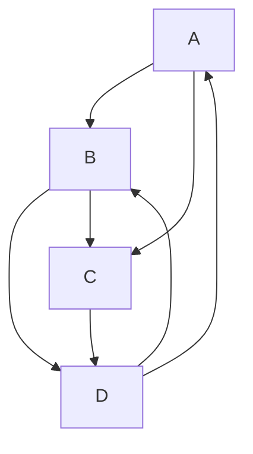
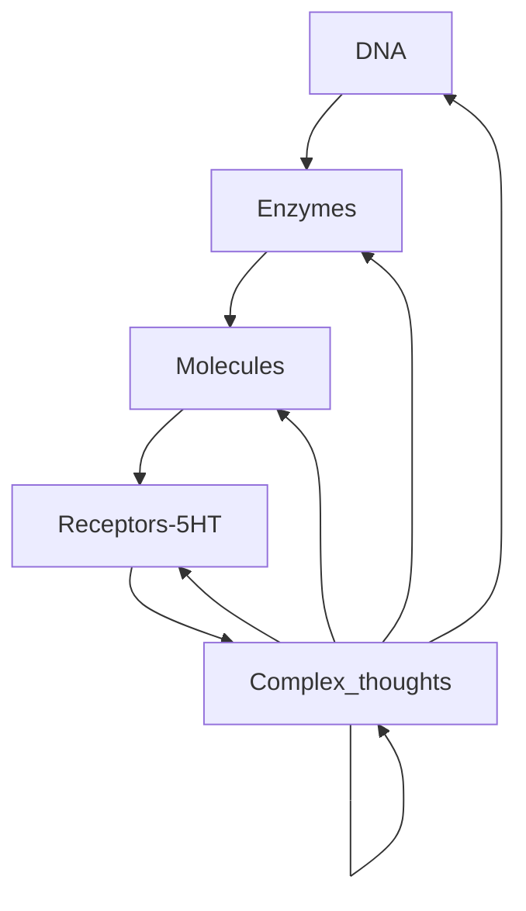

(ZK imported)

# Un appel a propositions pour repenser le statut des plantes.

https://lapenseeecologique.com/repenser-le-statut-des-plantes/

Un tournant ontologique est observé dans les sciences sociales qui se mettent a intégrer (à très faibles doses sans doute) des entités non-humaine.
Quatre chercheurs en agro, sciences sociales, écologie et foresterie le propose.
Aurélie Javelle (ingénieure de recherche à Montpellier Supagro), Dusan Kazic (doctorant en sociologie, AgroParisTech), Jacques Tassin (chercheur en écologie au Cirad), et Ernst Zürcher (chercheur et ingénieur forestier à la Haute École spécialisée bernoise).

Comment entrer en relations avec les plantes de façon sensible ? <<<en les intégrant>>
Ici les psychotropes semble etre la voie royale. Ce qui amène a voir la chimie comme moyen de connexion entre l'humain et le végétal. Et a penser la molécule comme signal sémiotique porteur de sens (entre plantes mais aussi entre plantes et humains).

ADN (objet biologique porteur d'information par excellence - code) > Enzymes > Molécules > Récepteurs 5HT > Pensées complexes > ADN (recursive process) [[recursive]]

Continuer les recherches sur la biosémiose et toutes les investigations effectuées dans ce sens par l’équipe de l'Université de Turku.
Also investigate recursive processes. https://fr.wikipedia.org/wiki/R%C3%A9cursivit%C3%A9

//Done schema and diagrams in markdown
Move this in a separate note. Again check amoeba pattern

2021-01-17 13:44

Testing Mermaid with dendron md preview plugins 

This should appear like the image below, when https://github.com/dendronhq/dendron/issues/454 is addressed.

