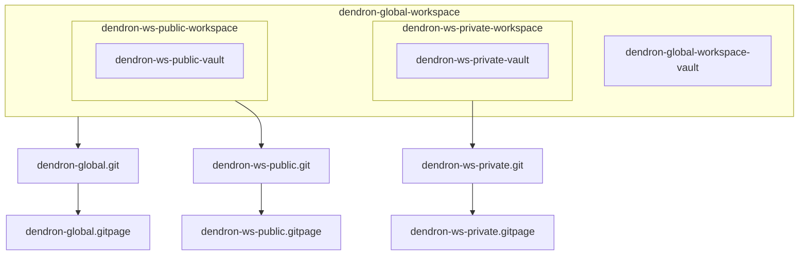

# What are we talking about ?

Multivault configuration is a way to put your Dendron notes into compartements.
Multiple reason can lead you to head towards a multivaults setup. 
Here are some of them https://wiki.dendron.so/notes/24b176f1-685d-44e1-a1b0-1704b1a92ca0.html#use-cases

However they are multiple ways of setting up a multivault configuration.
In my case I have been wanting to set this up for a long time and tried at least 3 times with no success. 

# Why this note ?

So I will write a note regarding the recipe I followed for what seems to be (up to now) a convenient solution for me. This is a note for my future self but also for people how have been having difficulties to setup up a multivault configurations.

# What do I want ?

My requirements were the following ones:

- at least two vaults but possibility to accomodate more if needed
- all vaults should be git versioned and have a remote repo (github)
- the vaults should be git versioned on a private or public git repo 
- all vaults should be possibly publishable as github pages


One thing that confounded me at first was the distinction between vaults and workspace.
After enough trial an error the setup I adopted is the following one.

# What do I have now ?

I have 3 dendron **workspaces**. 

- **dendron-global**
- **dendron-ws-private**
- **dendron-ws-public**

**dendron-global** and **dendron-ws-private** are git-versioned on a private github repos (https://github.com/oolonek/dendron-global and https://github.com/oolonek/dendron-ws-private, respectively) while **dendron-ws-public** is versioned on a public repo (https://github.com/oolonek/dendron-ws-public). 

I did a 'Dendron: Vault add' command from the **dendron-global** vault to incorporate **dendron-ws-private** and **dendron-ws-public**.

As a result I have three websites:

https://oolonek.github.io/dendron-global/
https://oolonek.github.io/dendron-ws-private/
https://oolonek.github.io/dendron-ws-public/

These reflect their own vaults (**dendron-ws-private** and **dendron-ws-public**) or the totality (dendron-global). 


See flowchart below : 



Where : 

- dendron-global.git is https://github.com/oolonek/dendron-global 
- dendron-ws-private.git is https://github.com/oolonek/dendron-ws-private
- dendron-ws-public.git is https://github.com/oolonek/dendron-ws-public

and

- dendron-global.gitpage is https://oolonek.github.io/dendron-global/
- dendron-ws-private.gitpage is https://oolonek.github.io/dendron-ws-private/
- dendron-ws-public.gitpage is https://oolonek.github.io/dendron-ws-public/

# Recipe

- Initialize a new workspace by cmd+shit+p Dendron:Initialize Workspace
Name it as you want but let the default vault name as vault

- Go to Github and create new private or public repo as you wish

- Open VSCode at the workspace level (not at the vault level) and in terminal:

```
git init
git add . 
git commit -m 'initial commit'
git remote add origin https://github.com/oolonek/dendron-global.git
git push -u origin main
(complains)
git pull origin main  
git config pull.rebase true
git pull origin main  
git push -u origin main
```

- repeat the previous steps for the two other workspaces

- We set up the repo so that they are publish automatically using the gh actions

https://wiki.dendron.so/notes/230d0ccf-5758-4a8f-b39b-3b68e1482e2b.html
and 
https://wiki.dendron.so/notes/877f4347-f013-43ba-aec4-87412b2e1bec.html

But follow only the steps required for gh action triggered publishing (no need for local publishing first)
So just change your dendron.yml  by adding

```
    siteUrl: https://oolonek.github.io
    assetsPrefix: dendron-ws-public
```

- To create the package.json at the ws roots we run from the terminal

```
npm init -y
npm install @dendronhq/dendron-cli@latest
npm install @dendronhq/dendron-11ty@latest
```

- We modify the dendron.yml to have the gh edit link

```
    gh_edit_link: true
    gh_edit_link_text: Click here to edit this page on Github !
    gh_edit_repository: 'https://github.com/oolonek/dendron-ws-public'
    gh_edit_branch: main
    gh_edit_view_mode: edit
    assetsPrefix: dendron-ws-public
```

- Repeat for all repos. 

- Check that all websites publish correctly when you push a new note.

- Now at the vault level (not workspace level) of your global workspace (here called dendron-global in the previous schema) you cmd+shit+p Dendron: Vault Add/remote and paste the github adress of the repos you want to integrate.
This should automatically upgrade the dendron.yml of the global workspace.

- The last step is important else you will not be able to publish from the global repo. You need to add checkout actions to the .github/workflows/dendron-actions.yml See example below to checkout a publi and a private repo:

```
            - name: Checkout source
              uses: actions/checkout@v2

            - name: Checkout public repo
              uses: actions/checkout@v2
              with:
                repository: oolonek/dendron-ws-public
                path: dendron-ws-public

            - name: Checkout private repo
              uses: actions/checkout@v2
              with:
                repository: oolonek/dendron-ws-private
                token: ${{ secrets.BUILD_ACCESS_SECRET }} # `GitHub_PAT` is a secret that contains your PAT
                path: dendron-ws-private

```

Note that you will need to prepare a PAT if you pull from a private repo.

# Questions or editions

Please comment directly on github by clicking the link below 👇


